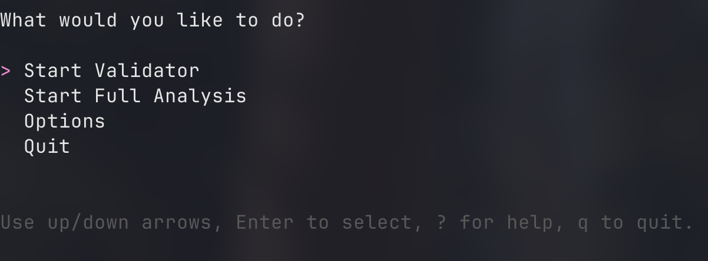
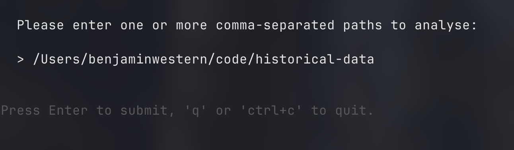
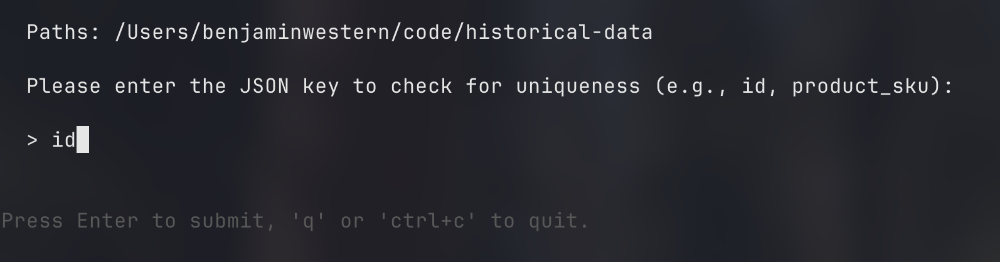
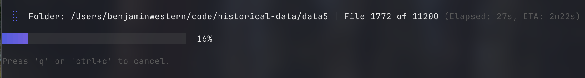
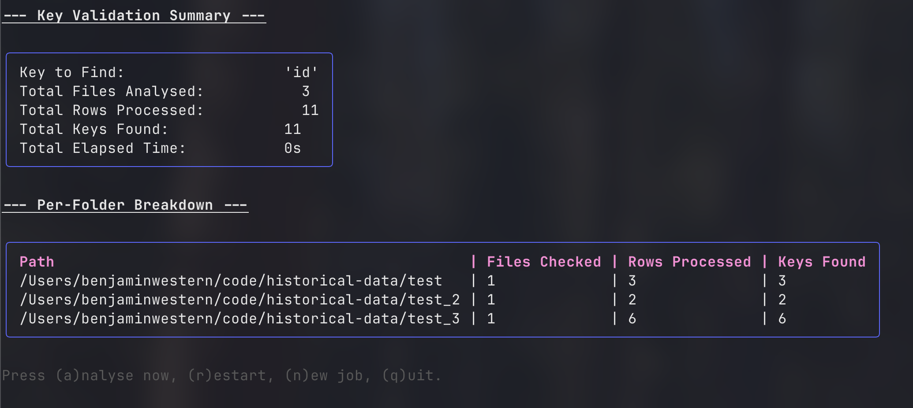
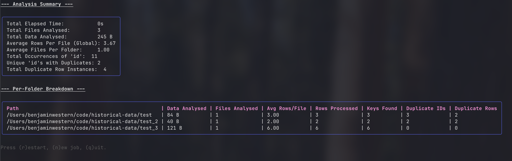
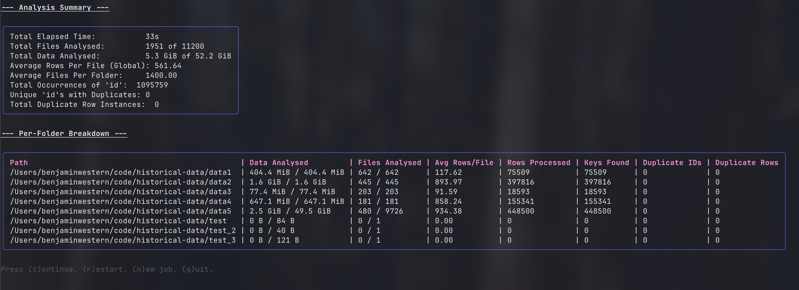
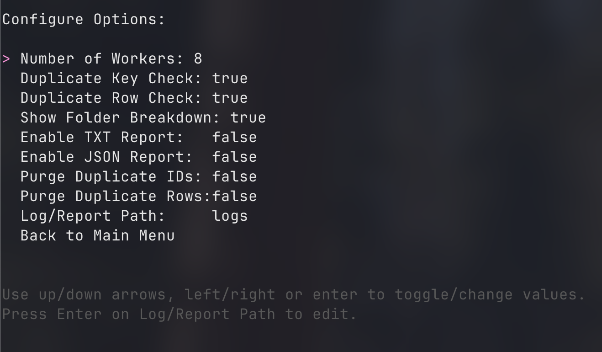

# Dupe Analyser

A high-performance Go utility for finding duplicate data within large sets of local or cloud-based JSON and NDJSON files.



## Introduction

I created Dupe Analyser out of a need to bulk validate large sets of historical data against newly crawled information. When dealing with hundreds of gigabytes of data across thousands of files, it became critical to have a tool that could quickly profile the data's integrity and then perform a deep analysis to find duplicate entries based on unique keys or entire row content.

This tool is designed to be fast, memory-efficient, and flexible, offering both an interactive Terminal User Interface (TUI) for hands-on work and a headless CLI mode for automation.

This project was developed with the help of Google's Gemini 2.5 Pro as my 'rubber duck', which was invaluable for validating ideas and working through complex state management challenges and also who I will be blaming for any bad or non-optimal code :)

Gemini also wrote this readme because I was lazy...

## Key Features

* **Dual-Mode Operation:** Run with a rich, interactive TUI or as a standard headless CLI application.
* **Multi-Source Support:** Analyse files from local directories and Google Cloud Storage (GCS) buckets in the same run.
* **Flexible Analysis:** Find duplicates based on a specific JSON key (`-key`) or by hashing the entire content of each row.
* **Data Profiling:** A fast "Validator" mode to quickly check for the presence and count of a key across all files before running a full analysis.
* **Robust Session Management:** Cancel, continue, and restart analysis jobs from within the TUI.
* **Comprehensive Reporting:** Detailed summary reports and per-folder breakdown tables give a clear overview of the results.
* **Intelligent Path Handling:** Automatically de-duplicates sources when overlapping paths (e.g., `./data` and `../project/data`) are provided.
* **Persistent Configuration:** User preferences are saved to `config/config.json` for a consistent experience across sessions.

## Installation

Ensure you have Go installed (version 1.21 or newer). I will try and get it up into go packages soon.
For now you will either need to build / go run from `cmd`

## Usage

Dupe Analyser can be run in two main modes: an interactive TUI (default) or a headless CLI mode.

### TUI (Interactive Mode)

To start the TUI, simply run the application without the `-headless` or `-validate` flags.

```sh
dupe-analyser -path /path/to/data
```

You will be greeted with a main menu that allows you to:

* **Start Validator:** A fast, read-only mode to check for the existence and count of a specific key. This is perfect for profiling your data before a full analysis.
* **Start Full Analysis:** The main mode for finding duplicate keys and rows.
* **Options:** Configure settings like worker count, report generation, and purge options. Changes are saved automatically.
* **Quit:** Exit the application.

#### TUI Workflow

1. **Main Menu:** Choose your action.
    

2. **Path Input:** Provide one or more comma-separated local or GCS paths.
    

3. **Key Input:** Specify the unique key for the analysis.
    

4. **Processing:** Monitor the progress of the job in real-time.
    

5. **Report Screen:** View the results.
    * **Validation Report:**
      
    * **Analysis Report:**
      
    * **Partial Report (after cancellation):**
      

6. **Options Menu:** Configure all settings interactively.
    

#### TUI Keybindings

| Key        | Action                                                  |
|------------|---------------------------------------------------------|
| `↑` / `↓`  | Navigate menus.                                         |
| `enter`    | Select an option or submit input.                       |
| `esc`      | Go back to the previous menu.                           |
| `q`, `ctrl+c` | Cancel an ongoing job or quit the application.        |
| `?`        | Show the help screen (from main menu).                  |
| `r`        | **Restart** the last job from the beginning.            |
| `c`        | **Continue** a previously cancelled job from where it left off. |
| `n`        | Start a **New Job**, clearing previous paths and keys.    |
| `a`        | Run a **Full Analysis** after a validation report.      |
| `p`        | **Purge** duplicates (local files only, after analysis).|

### Headless (CLI Mode)

For scripting and automation, use the `-headless` or `-validate` flags. The report will be printed directly to the console.

**Full Analysis Example:**

```sh
dupe-analyser -headless -path /path/a,/path/b -key user_id -check.row=true
```

**Validation Example:**

```sh
dupe-analyser -validate -path gs://my-bucket/stuff -key order_id
```

#### All CLI Flags

| Flag                  | Default    | Description                                                          |
|-----------------------|------------|----------------------------------------------------------------------|
| `-path`               | `""`       | Comma-separated list of paths to analyse (local or GCS). Required.   |
| `-key`                | `"id"`     | JSON key to check for uniqueness.                                    |
| `-workers`            | `8`        | Number of concurrent workers.                                        |
| `-log-path`           | `"logs"`   | Directory to save logs and reports.                                  |
| `-validate`           | `false`    | Run a key validation test and exit (headless only).                  |
| `-headless`           | `false`    | Run without TUI and print report to stdout.                          |
| `-check.key`          | `true`     | Enable duplicate key check.                                          |
| `-check.row`          | `true`     | Enable duplicate row check (hashing).                                |
| `-output.txt`         | `false`    | Enable `.txt` report output.                                         |
| `-output.json`        | `false`    | Enable `.json` report output.                                        |
| `-show.folders`       | `true`     | Show per-folder breakdown table in summary.                          |
| `-purge-ids`          | `false`    | Enable interactive purging of duplicate IDs (local files only).      |
| `-purge-rows`         | `false`    | Enable interactive purging of duplicate rows (local files only).     |
| `-output`             | `"txt"`    | Output format for headless mode (`txt` or `json`).                   |

## Configuration

On first run, or when options are changed in the TUI, a configuration file is created at `config/config.json`. The application uses the following priority for settings:

1. **CLI Flags:** Always have the highest priority and will override any other settings.
2. **Config File:** Values from `config/config.json` are loaded on startup.
3. **Defaults:** Hard-coded default values are used if no other setting is provided.

## Core Concepts

### Validator vs. Analyser

* **Validator Mode:** A high-speed, read-only mode designed for data profiling. It streams through all files to answer one question: "Does this key exist, and how many times?". It performs no duplicate tracking and is significantly faster than a full analysis. This is the ideal first step to ensure your data schema is correct.

* **Analyser Mode:** The deep-dive mode. It performs the same initial checks as the validator but additionally stores the locations of every key and a hash of every row in memory to find duplicates. This is more memory-intensive and is intended for finding specific duplicate entries after the data has been profiled.

Of course. Here is a section for the `README.md` that explains the "Continue" functionality.

---

### Intelligent Session Management: Continue, Restart, and New

The TUI provides robust session management to handle interruptions and different analysis workflows:

* **Continue (`c`):** If you cancel a job (`ctrl+c`), the application preserves the entire state of the analyser, including all partial results and the elapsed time. From the report screen, pressing `(c)` will seamlessly resume the analysis only on the remaining, unprocessed files. The elapsed time will continue from where it left off, giving you an accurate measure of the total time spent.

    

* **Restart (`r`):** This option discards any partial progress and runs the *exact same job* again from the beginning, using the same paths and key. The timer is reset to zero. This is useful if you want a clean run without changing any parameters.

* **New Job (`n`):** This option provides a completely clean slate. It clears the previously used paths and key, allowing you to define a brand new analysis or validation run from scratch.

---

### Purging Duplicates

> **Note:** The interactive purge functionality is currently undergoing a refactor to improve its reliability and is temporarily bugged. This will be fixed in an upcoming release.

When a full analysis on local files finds duplicates, you can press `(p)` to enter the interactive purge workflow. For each set of duplicates, you will be prompted to select the one record you wish to keep. All other records in that set will be moved to a `deleted_records` directory in the current working directory, and the original file will be overwritten.

## Future Development

This tool is under active development. Features on the roadmap include:

* **Fix Purge Functionality:** Resolve the current bug in the interactive purge workflow.
* **GCS Purge Functionality:** Implement a mechanism to purge duplicates from GCS files (e.g., download, purge, and re-upload/overwrite).
* **TUI Polish:** Minor improvements to formatting and layout for even clearer presentation.
* **Performance Optimisation:** Further profiling of goroutine usage for file and row processing to maximise efficiency.
* **Test Coverage:** Introduction of a comprehensive suite of unit and integration tests to improve stability and encourage community contributions.

## License

This project is licensed under the MIT License.
